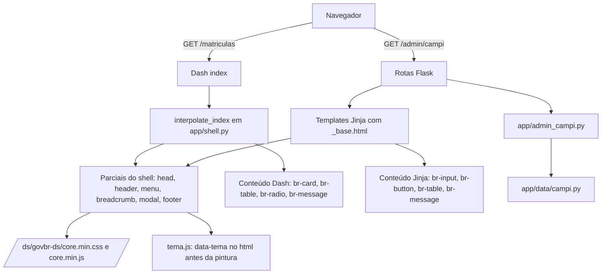

# Design responsivo com o gov.br Design System Design

**Spec**: `.specs/features/govbr-design-system/spec.md`
**Status**: Approved

---

## Ajustes na spec (aprovados e aplicados em 2026-09-19)

O Design encontrou quatro pontos em que a spec aprovada não cabe no DS 3.7.0 ou no Dash. Os quatro ajustes abaixo foram aprovados e já estão em `spec.md`.

| Requisito | Problema | Ajuste proposto |
| --------- | -------- | --------------- |
| DS-04, DS-05 | Menu recolhido abaixo de 992px e expandido, sem botão, a partir de 992px. O `br-menu` do DS é um painel lateral aberto por botão hambúrguer, presente em todas as larguras (Template V3 Base) | Menu principal em `br-menu`: sobreposto e fechado por padrão abaixo de 992px; a partir de 992px, persistente como barra lateral fixa à esquerda, sem hambúrguer. Ajuste de 2026-09-20 (AD-005): a barra horizontal com hambúrguer ficou ruim em telas largas |
| DS-15 | `br-select` é um controle montado por JavaScript do DS; o Dash cria o filtro depois do carregamento, e o `core.min.js` só inicializa o que existe na carga. Não há como ligar `br-select` aos callbacks sem um adaptador frágil | Radios em `br-radio` e botões em `br-button`. Selects em `dcc.Dropdown` com as variáveis do DS (é a alternativa que você aprovou) |
| DS-27 | Deixa de fazer sentido: cabeçalho, menu, modal e rodapé ficam no shell, que existe na carga, e o conteúdo do Dash usa só componentes que dependem apenas de CSS | Trocar por: "The system SHALL usar em conteúdo renderizado pelo Dash apenas componentes do DS que funcionam sem JavaScript" |
| DS-81 | A busca "ao digitar" exigiria JavaScript próprio | "WHEN o usuário envia a busca (Enter ou botão de lupa) THEN ..." Busca, paginação e cards ficam no servidor, por parâmetros de URL |

---

## Architecture Overview

Um shell único, escrito uma vez em Jinja, serve as páginas administrativas (Flask) e envolve as páginas públicas (Dash). O Dash passa a renderizar só o conteúdo de `<main>`.



Regras que valem para todo o desenho:

1. Cabeçalho, menu, breadcrumb, botão de tema, modal de confirmação e rodapé existem só nos parciais do shell. O item ativo do menu e o breadcrumb vêm do servidor, pelo caminho da requisição.
2. Os links entre páginas públicas são `<a>` comuns: cada troca de página é um carregamento completo. Isso troca a navegação sem recarga por um DOM que o JS do DS enxerga na carga.
3. O DS é servido de `app/static/govbr-ds/`, fora de `app/assets/`, para o Dash parar de carregar os 162 arquivos. O shell carrega `core.min.css` e `core.min.js` uma vez.
4. As cores do tema escuro saem só das variáveis semânticas do DS (`--background`, `--color`, `--interactive`…), que já têm versões `-light` e `-dark` em `core-tokens.css`.
5. Busca, paginação e cards da lista de campi rodam no servidor. As telas de campus são páginas Flask com redirecionamento após POST.

---

## Code Reuse Analysis

### Existing Components to Leverage

| Component | Location | How to Use |
| --------- | -------- | ---------- |
| `dados_instituicao`, `get_contato_email` | `app/data/config_store.py` | Alimentam o cabeçalho e o rodapé do shell, como hoje em `_contexto_base()` (`app/app.py:128`) |
| `GET /branding/logo` | `app/app.py:825` | O `` do logotipo do cabeçalho continua apontando para esta rota |
| `listar_campi`, `salvar_campus_manual`, `incluir_campus`, `excluir_campus`, `definir_ativo`, `id_suspeito`, `CampusInvalido` | `app/data/campi.py` | Regras e persistência do CRUD, sem mudança de comportamento |
| `requer_autenticacao` | `app/auth.py` | Protege as novas rotas de campus |
| Guarda `_exigir_instalacao` | `app/app.py:252` | Já vale para todas as rotas do `server`, inclusive as do novo blueprint |
| Classes `br-button`, `br-input`, `br-table` | `app/templates/*.html` | Já usadas; passam a vir de macros compartilhados |
| Padrão de teste com `server.test_client()` e `session_transaction` | `tests/test_instalacao.py:131` | Modelo dos testes de shell e de CRUD |
| Funções de formatação | `app/components/kpi.py` (`formatar_valor`) | Ficam; só o invólucro do cartão muda |

### Integration Points

| System | Integration Method |
| ------ | ------------------ |
| Dash | Subclasse de `dash.Dash` com `interpolate_index` (assinatura verificada: `metas, title, css, config, scripts, app_entry, favicon, renderer`). Monta o HTML com os parciais do shell e põe `app_entry` dentro de `<main id="main-content">` |
| Flask | Blueprint `ds_static` com `static_folder=app/static` e `static_url_path=/ds`; blueprint `campi_bp`; context processor que injeta o contexto do shell em todo template |
| SQLite | Sem mudança de schema |
| Sessão Flask | `flask.flash` para mensagens após redirecionamento (usa `server.secret_key`, `app/app.py:69`) |

---

## Components

### DsAssets (arquivos estáticos do DS)

- **Purpose**: Servir o gov.br DS 3.7.0, o Font Awesome 5 e a fonte Rawline localmente, sem Dash e sem CDN.
- **Location**: `app/static/govbr-ds/` (movido com `git mv` de `app/assets/govbr-ds/`), `app/static/vendor/fontawesome/`, `app/static/vendor/rawline/`, `app/static/js/`.
- **Interfaces**:
  - `GET /ds/govbr-ds/dist/core.min.css`, `GET /ds/govbr-ds/dist/core.min.js`
  - `GET /ds/js/tema.js`, `GET /ds/js/confirmar.js`, `GET /ds/js/atualizar.js`
- **Dependencies**: Blueprint `ds_static` em `app/shell.py`.
- **Reuses**: O conteúdo já versionado de `app/assets/govbr-ds/`.
- **Pré-requisito**: o CSS do DS pede a família "Font Awesome 5 Free" (`core.css:29845`) e a fonte Rawline (`core-tokens.css:970`), e nenhuma das duas está no pacote. Baixar `@fortawesome/fontawesome-free` 5.x (só os `webfonts` de `fa-solid-900`, `fa-regular-400` e `fa-brands-400`, mais o CSS) e a Rawline exige rede e autorização suas. Não sei a licença de redistribuição da Rawline: confirmar antes de versionar. Sem ela, o `--font-family-base` cai em Raleway e depois em sans-serif.

### Shell (`app/shell.py`)

- **Purpose**: Montar o contexto e o HTML do cabeçalho, do menu, do breadcrumb e do rodapé, iguais nas páginas Flask e Dash.
- **Location**: `app/shell.py`; parciais em `app/templates/shell/`.
- **Interfaces**:
  - `PAGINAS_PUBLICAS: list[ItemMenu]` e `PAGINAS_ADMIN: list[ItemMenu]` - fonte única dos itens de menu (substitui `PAGINAS` de `app/components/navigation.py`).
  - `contexto_shell(caminho: str) -> dict` - itens de menu com `ativo`, breadcrumb, instituição, e-mail de contato, tema padrão.
  - `class PainelDash(dash.Dash)` com `interpolate_index(...)` - devolve o HTML completo com os parciais.
  - `init_shell(server, dash_app) -> None` - registra o blueprint estático, o context processor e o filtro de breadcrumb.
- **Dependencies**: `app/data/config_store.py`, Jinja do Flask.
- **Reuses**: `_contexto_base()` de `app/app.py`; a lista `PAGINAS` de `app/components/navigation.py`.

### Parciais Jinja (`app/templates/shell/`)

- **Purpose**: O HTML do shell e os macros dos formulários, em um lugar só.
- **Location**: `app/templates/shell/_head.html`, `_header.html`, `_menu.html`, `_breadcrumb.html`, `_modal_confirmacao.html`, `_footer.html`, `_macros.html`.
- **Interfaces** (macros em `_macros.html`):
  - `campo(nome, rotulo, valor, erro=None, ajuda=None, obrigatorio=False, tipo="text")` - `br-input` com rótulo acima e erro em `danger`.
  - `mensagem(tipo, texto, titulo=None)` - `br-message` com `role="alert"` (danger) ou `role="status"`.
  - `tag_situacao(ativo)` - `br-tag` "Ativo" ou "Desativado".
  - `botoes_formulario(cancelar_href, rotulo_salvar)` - Cancelar (`secondary`) e Salvar (`primary`).
  - `botao_icone(icone, rotulo, ...)` - botão só de ícone com `aria-label` e tooltip.
- **Dependencies**: DS via `DsAssets`.
- **Reuses**: Marcação de `br-input`, `br-button` e `br-table` que já existe em `login.html` e `configuracoes.html`.

### Tema (`app/static/js/tema.js` e regras em `style.css`)

- **Purpose**: Escolher e aplicar claro ou escuro antes da primeira pintura, com botão no cabeçalho.
- **Location**: trecho inline no `<head>` (`_head.html`) e `app/static/js/tema.js` para o botão.
- **Interfaces**:
  - Atributo `data-tema="claro|escuro"` em `<html>`.
  - `localStorage["calcsistec-tema"]` com `claro` ou `escuro`; qualquer falha de acesso é capturada.
  - CSS `:root[data-tema="escuro"]` remapeia os tokens semânticos para as variantes `-dark`.
- **Dependencies**: `prefers-color-scheme`, `localStorage` (opcional).
- **Reuses**: Tokens `--background`, `--color`, `--interactive`, `--focus-color`, `--hover`, `--pressed`, `--visited` e suas variantes `-light` e `-dark` de `core-tokens.css:936-1000`.

### Modal de confirmação (`confirmar.js` e `_modal_confirmacao.html`)

- **Purpose**: Trocar `confirm()` por `br-scrim` + `br-modal`, mantendo o atributo `data-confirm` como interface.
- **Location**: `app/static/js/confirmar.js`; markup único no `_base.html`.
- **Interfaces**:
  - `window.confirmarAcao(mensagem, {rotuloConfirmar}) -> Promise<boolean>` - abre o modal, prende o foco, fecha com Esc e devolve o foco ao controle de origem.
  - Formulários com `.confirm-form` e botões com `data-confirm` continuam válidos; o script intercepta o envio.
- **Dependencies**: CSS `br-scrim.foco.active` e `br-modal` do DS.
- **Reuses**: Textos de `data-confirm` já existentes em `atualizar.html` e `configuracoes.html`; troca `confirm(...)` em `configuracoes.html:247` e `atualizar.js:250,277,284`.

### CRUD de campi (`app/admin_campi.py`)

- **Purpose**: Listar, buscar, paginar, editar, incluir, desativar e excluir campi em páginas do DS.
- **Location**: `app/admin_campi.py`; templates `campi_lista.html`, `campi_form.html`.
- **Interfaces**:
  - `GET /admin/campi?q=&por_pagina=10&pagina=1&visao=lista|cards`
  - `GET|POST /admin/campi/novo`
  - `GET|POST /admin/campi/<id_perfil>/editar`
  - `POST /admin/campi/<id_perfil>/situacao` (campo `ativo=0|1`)
  - `POST /admin/campi/<id_perfil>/excluir`
  - `filtrar_e_paginar(campi, q, pagina, por_pagina) -> PaginaCampi` - função pura.
- **Dependencies**: `app/data/campi.py`, `flask.flash`, macros do shell.
- **Reuses**: Todas as funções de `app/data/campi.py`; `requer_autenticacao`.
- **Mudanças em `app/data/campi.py`**:
  - `obter_campus(id_perfil, db_path) -> dict | None` (novo).
  - `validar_campos_campus(dados, exigir_nome_perfil=False) -> dict[str, str]` (novo, sem I/O): campo -> "Preencha o campo obrigatório".
  - `CampusInvalido(mensagem, campo=None)`: ganha o atributo `campo` (`id_perfil` ou `co_unidade`), com valor padrão que preserva os chamadores atuais.
- **Mudanças em `/admin/config`**: sai a lista editável e as ações `salvar_campus`, `incluir_campus`, `excluir_campus`, `ativar_campus`, `desativar_campus`. A seção "Campi do Sistec" vira um resumo com o link "Gerenciar campi". Ficam ali `salvar_qtd_perfis` e `importar_perfis`, com os campos no layout do DS.

### Conteúdo público (`app/components/`, `app/pages/`)

- **Purpose**: Renderizar KPIs, tabelas, filtros e avisos com componentes do DS que funcionam só com CSS.
- **Location**: `app/components/kpi.py`, `filters.py`, `aviso_sem_pnp.py`, novo `app/components/tabela.py`; `app/pages/*.py`.
- **Interfaces**:
  - `kpi_card(label, valor, formato, empty_state)` - mesma assinatura; gera `div.br-card`.
  - `tabela_ds(colunas, linhas, legenda) -> html.Div` - `div.br-table > div.responsive > table` (rolagem contida, DS-08).
  - `fic_toggle`, `axis_selector` - `dbc.RadioItems(className="br-radio")` (a marcação `input + label` irmãos que o `br-radio` exige é a que o `dbc.RadioItems` gera).
  - `select_filter` - `dcc.Dropdown` com variáveis do DS.
  - `clear_filters_button(id_)` - `html.Button(className="br-button primary")`, mantendo `n_clicks`.
  - `make_aviso_sem_pnp()` - `br-message warning`.
- **Dependencies**: `dash`, `dash_bootstrap_components` (só `RadioItems`; sem o tema Bootstrap).
- **Reuses**: Toda a lógica de callbacks e de domínio das páginas, sem mudança.

### Removidos

`app/components/header.py`, `footer.py`, `navigation.py`, `app/assets/nav-toggle.js`, `app/templates/_admin_nav.html`, o `index_string` fixo de `app/app.py:47` e `serve_layout()` com cabeçalho e rodapé (`app/app.py:92`).

---

## Data Models

```python
class ItemMenu(TypedDict):
    rotulo: str
    href: str
    ativo: bool          # comparado ao caminho da requisição

class Migalha(TypedDict):
    rotulo: str
    href: str | None     # None na página atual

class PaginaCampi(TypedDict):
    itens: list[dict]    # linhas de campi_sistec
    total: int           # total após a busca
    pagina: int
    por_pagina: int      # 10, 25 ou 50
    inicio: int          # índice 1-based do primeiro item exibido
    fim: int
```

**Relationships**: `itens` reusa as colunas de `campi_sistec` (`id_perfil`, `nome_perfil`, `co_unidade`, `cidade`, `nome_unidade`, `ativo`, `origem`). Não há mudança de schema. O tema é só estado do navegador (`localStorage`), sem dado no servidor.

---

## Error Handling Strategy

| Error Scenario | Handling | User Impact |
| -------------- | -------- | ----------- |
| Campo obrigatório vazio na edição ou inclusão | `validar_campos_campus` devolve o mapa de erros; a página é renderizada de novo (status 200) com os valores digitados | Campo em `danger` com "Preencha o campo obrigatório" e banner de erro no topo |
| Identificador ou código já usado | `CampusInvalido.campo` indica o campo; a página volta com o erro nesse campo | Campo em `danger` com a mensagem da regra |
| Campus inexistente (aba antiga, exclusão duplicada) | `obter_campus` devolve `None`; redireciona para `/admin/campi` com `flash` `danger` | "Campus não encontrado." na lista |
| Busca sem resultado | `PaginaCampi.total == 0` | `br-message info` "Nenhum campus encontrado." |
| Nenhum campus cadastrado | Lista vazia sem busca | `br-message info` convidando a importar a lista ou incluir |
| `pagina` ou `por_pagina` inválidos na URL | Corrigidos para 1 e 10 | Lista normal, sem erro |
| `localStorage` bloqueado | `try/catch` em `tema.js`; tema vale só na página aberta | Nenhum erro visível; volta à preferência do sistema na próxima carga |
| `core.min.js` não carrega | `onerror` no `<script>` põe `ds-sem-js` no `<html>`; o CSS mostra o menu como lista | Links de navegação continuam acessíveis |
| Logotipo ausente | `GET /branding/logo` já cai em `padrao-generico.svg` | Logotipo genérico sobre superfície clara |

---

## Risks & Concerns

| Concern | Location (file:line) | Impact | Mitigation |
| ------- | -------------------- | ------ | ---------- |
| Rotas administrativas com POST sem token CSRF; só `SameSite=Lax` protege | `app/config.py:18`, rotas em `app/app.py:132` em diante | As novas rotas de exclusão e situação herdam a mesma exposição | Fora do escopo da feature. Registrar como pendência de segurança em `CUTOVER.md`; não adicionar token só nas rotas novas para não criar dois padrões |
| `app/assets/js/atualizar.js` é carregado pelo Dash em todas as páginas públicas | `app/templates/atualizar.html:74`, `app/assets/` | Script administrativo baixado e executado em páginas públicas | Mover para `app/static/js/` e referenciar em `atualizar.html` (parte da tarefa de mover os assets) |
| `confirm()` nativo em três pontos | `app/templates/configuracoes.html:247`, `app/assets/js/atualizar.js:250,277,284` | Viola DS-58/59 e não tem foco preso nem Esc | `confirmar.js` mantém `data-confirm` como interface, então as 12 ocorrências não mudam de marcação |
| DS sem fonte nem ícones locais | `core.css:29845`, `core-tokens.css:970` | Ícones (editar, excluir, tema, lupa) aparecem quebrados; fonte cai em Raleway ou sans-serif | Baixar Font Awesome 5 Free e (se a licença permitir) Rawline para `app/static/vendor/`; sem eles, botões de ícone levam texto acessível e o layout continua legível |
| Sem `.dark-mode` para header, menu, footer e message no CSS do DS | `dist/components/*/`, busca em `header.css`, `footer.css`, `menu.css`, `message.css` | O remapeamento de tokens pode deixar algum componente claro | Primeira tarefa do tema é uma verificação visual em 1280px; lacunas viram regras em `style.css` só com variáveis do DS |
| Rota única `/admin/config` com 280 linhas e muitas ações | `app/app.py:522-801` | Mexer nela arrisca regressão em fatores, e-mail e logotipo | Só remover as 5 ações de campi e trocar a seção do template; nenhuma outra refatoração |
| Importar `app.app` executa `init_db` no banco real | `app/app.py:75` | Testes novos de shell e CRUD escrevem no `sistec.db` real | Testes de CRUD monkeypatcham o caminho do banco; testes de shell só leem. Manter o padrão de `tests/test_instalacao.py:131` |
| Não há testes de interface hoje | `tests/` | Nenhuma rede contra regressão do layout | `test_shell.py`, `test_style_css.py`, `test_componentes_publicos.py`, `test_admin_campi.py`; larguras reais ficam na verificação visual (premissa da spec) |
| `CampusInvalido` não diz qual campo falhou | `app/data/campi.py:30` | Mapear erro por texto da mensagem seria frágil | Atributo `campo` com padrão `None`; testes em `tests/test_campi.py` cobrem os dois campos |
| `br-menu` persistente (a partir de 992px) não foi exercitado | Template V3 Base (SVG) | O modo push pode quebrar a grade de 12 colunas | Verificação visual na tarefa do menu; resultado: o menu fica em barra lateral fixa à esquerda (AD-005) |
| Navegação pública passa a recarregar a página | `app/shell.py` (novo) | Mais lento que a troca sem recarga de hoje | Decisão consciente da arquitetura escolhida; o Dash já busca os dados de cada página a cada carga |

---

## Tech Decisions (only non-obvious ones)

| Decision | Choice | Rationale |
| -------- | ------ | --------- |
| Onde fica o DS | `app/static/govbr-ds/`, URL `/ds/govbr-ds/`, fora de `app/assets/` | O Dash carrega recursivamente tudo de `assets/`; fora dele o shell controla o que carrega |
| Qual JS do DS | `core-init.min.js` (AD-004; a premissa inicial de que `core.min.js` inicializava os componentes estava errada, e a verificação no Chrome mostrou que o menu não abria) | `core-init.min.js` instancia os componentes na carga; `core.min.js` só registra os comportamentos. Os dois têm o mesmo tamanho (cerca de 232 KB); `core-base.js` exporta as classes sem inicializar, mas não existe versão `.min`, o que violaria DS-28. O shell existe na carga, então a inicialização única basta |
| Como o Dash recebe o shell | Subclasse `PainelDash` com `interpolate_index` | API pública do Dash; deixa o `<html>`, o `<head>` e o `<main>` sob controle do shell |
| Tema | `data-tema` em `<html>` e remapeamento dos tokens semânticos `-dark` do DS | O DS 3.7.0 não tem tema global; os tokens já trazem os pares claro e escuro |
| Onde roda busca e paginação de campi | No servidor, por parâmetros de URL | Testável com `test_client`, sem JS; cerca de 22 linhas |
| Mensagens após salvar | `flask.flash` com redirecionamento | Evita reenvio de formulário; usa a sessão que já existe |
| Radios dos filtros | `dbc.RadioItems(className="br-radio")` | O DOM do dbc (`input` e `label` irmãos) casa com os seletores descendentes de `.br-radio`; preserva o comportamento já testado |
| Confirmação | `data-confirm` mantido; `confirmar.js` abre `br-modal` | Não muda a marcação dos 12 pontos de uso |

> **Project-level decisions:** as três primeiras (DS fora de `assets/`, shell único e tema por tokens) foram registradas em `.specs/STATE.md` como `AD-001` a `AD-003`.

---

## Rastreabilidade: requisito para componente

| Requisitos | Componente |
| ---------- | ---------- |
| DS-01 a DS-03, DS-06 a DS-11, DS-43, DS-44 | Shell (`_head`, `_header`, `_menu`), `style.css` |
| DS-04, DS-05, DS-37, DS-38 | Shell (`_menu`) e ajuste proposto na spec |
| DS-12, DS-56, DS-61 | Shell (`contexto_shell`, `_breadcrumb`) |
| DS-13, DS-14, DS-15, DS-17, DS-18 | Conteúdo público |
| DS-16, DS-19, DS-39 a DS-41 | Shell (`_footer`, `_header`), `config_store` |
| DS-20 a DS-23, DS-57 | Parciais Jinja (`_macros`), `login.html`, `configuracoes.html` |
| DS-24 a DS-30 | DsAssets, `style.css` |
| DS-31 a DS-36 | Shell, `style.css` |
| DS-45 a DS-55 | Tema |
| DS-58 a DS-60, DS-73 a DS-75 | Modal de confirmação |
| DS-62 a DS-72, DS-76 a DS-79 | CRUD de campi |
| DS-80 a DS-83 | CRUD de campi (`filtrar_e_paginar`) |
| DS-84, DS-85 | CRUD de campi (`visao=cards`) |
| DS-42 | Verificação em dispositivo real (`CUTOVER.md`) |
