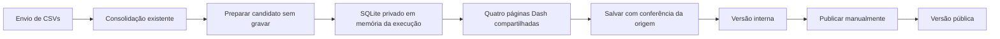

# Prévia das páginas públicas antes de salvar — Design

**Spec:** `.specs/features/previa-paginas-publicas/spec.md`
**Status:** Rascunho para aprovação

## Abordagens consideradas

| Abordagem | Como atende à spec | Vantagem | Custo e risco |
| --- | --- | --- | --- |
| **Recomendada: candidato em memória, páginas compartilhadas** | Preparar uma única versão candidata sem gravar; as quatro páginas e seus callbacks leem uma fonte pública ou a fonte privada da execução, conforme o contexto autenticado. | Não cria cópia em disco; mantém a mesma interface e as mesmas funções de cálculo. | A execução retém mais dados em RAM; cada callback precisa validar o contexto privado. |
| Banco SQLite temporário isolado | Preparar a versão candidata num banco privado temporário; as páginas apontam para esse banco durante a prévia. | Reaproveita mais consultas SQL existentes e controla melhor o tamanho em RAM. | Cria dados derivados em disco, exige limpeza segura em todos os estados e demanda o mesmo isolamento dos callbacks. |

A opção recomendada aproveita o registro de execuções em memória já usado pelo projeto e a restrição de produção a um único processo (`P-09`). O navegador recebe apenas a identificação da execução; não recebe DataFrames completos. [Dash documenta o custo de transportar dados grandes pelo `dcc.Store` e o uso de dados no servidor](https://dash.plotly.com/sharing-data-between-callbacks). [Dash Pages suporta páginas e layouts dinâmicos](https://dash.plotly.com/urls).

**Escolha confirmada pela usuária:** candidato em memória e quatro páginas compartilhadas. O banco temporário em disco foi rejeitado porque acrescentaria persistência e limpeza de uma cópia derivada sem melhorar a fidelidade da prévia.

## Architecture Overview



O envio continua usando `envio.ler_pastas` e `execucoes.registrar_leitura`. Após a consolidação, uma função de preparação produz as quatro tabelas que `salvar_interna` receberia, inclusive as linhas dos campi preservados e os fatores aplicados. Ela não grava essas tabelas. A execução mantém uma representação SQLite **somente em memória**, com as tabelas de leitura esperadas por `app.data.consulta`. Assim, a prévia e o público executam as mesmas consultas SQL e as mesmas funções das páginas e do domínio. [SQLite e Python documentam bancos nomeados em memória compartilhados por conexões do mesmo processo](https://sqlite.org/inmemorydb.html), [incluindo o uso de URI pelo `sqlite3`](https://docs.python.org/3.12/library/sqlite3.html#how-to-work-with-sqlite-uris).

A ligação entre a página e a execução é um identificador opaco em `dcc.Store`. Nenhum DataFrame vai para o navegador. As rotas de página e **cada callback que lê a prévia** verificam a sessão Flask, o identificador, a posse da execução, a origem `envio` e o estado `previa` antes da consulta. Um identificador forjado ou expirado nunca faz a leitura recair no banco público. O público continua lendo apenas `DEFAULT_DB_PATH`.

## Access and State Flow

1. O envio válido prepara o candidato uma vez, cria a fonte em memória e retorna os avisos e o `execucao_id`. A área **Prévia** de `/admin/atualizar` oferece quatro links `/admin/previa/<execucao_id>/<pagina>`, apenas para `origem=envio` em estado `previa`.
2. Uma única página Dash dinâmica em `app/pages/previa.py` valida o contexto e chama o `layout` da página pública correspondente com a fonte candidata. As páginas públicas mantêm suas URLs e funções; os callbacks recebem o identificador da fonte e o caminho atual como `State`. O caminho público sempre seleciona a fonte publicada, mesmo se um cliente forjar um identificador de prévia. Um caminho de prévia sem identificador válido é erro, nunca fallback público. O shell apresenta **Prévia não publicada**, links entre as quatro páginas e **Voltar para Atualizar dados**.
3. Em cada leitura, o servidor usa uma conexão própria, com `PRAGMA query_only=ON`, com o banco nomeado em memória da execução. `PRAGMA temp_store=MEMORY` impede arquivos auxiliares de consulta. O registro da execução mantém uma conexão âncora aberta enquanto a prévia existir. Uma trava por execução, adicionada ao registro, cobre a validação do estado e a leitura, evitando que Salvar/Descartar feche o candidato durante um callback.
4. Ao clicar **Salvar**, o servidor valida que as dependências da preparação não mudaram. `salvar_interna` recebe a assinatura esperada opcionalmente e a compara pela mesma conexão, depois de `BEGIN IMMEDIATE` e antes de apagar ou inserir qualquer linha. Se houver diferença, faz rollback e retorna conflito. Caso contrário, grava exatamente as tabelas já preparadas com `sqlite3.executemany` em lotes, incrementa `rev_interna`, registra o histórico existente, encerra a prévia e libera sua memória. **Descartar** libera a fonte sem gravar a versão interna.
5. URL antiga, sessão inválida, execução perdida ou contexto forjado exibem **Prévia indisponível** ou redirecionam ao login, conforme a spec. Nenhuma falha causa fallback para as tabelas públicas dentro da prévia.

O `GET` administrativo passa por um guarda Flask. Como o Dash monta layouts e filtros por requisições próprias, o layout dinâmico e todos os callbacks repetem a validação no servidor. O `dcc.Store` funciona como seletor, nunca como autorização. [A documentação do Flask confirma que `before_request` pode encerrar uma requisição antes da rota](https://flask.palletsprojects.com/en/stable/api/#flask.Flask.before_request); [a documentação do Dash mostra que páginas e callbacks são requisições distintas](https://dash.plotly.com/urls).

## Code Reuse Analysis

### Existing Components to Leverage

| Fato | Evidência | Consequência |
| --- | --- | --- |
| `montar_versao_interna` transforma e grava no mesmo passo | `app/data/ingest.py:175` e chamada de `salvar_interna` no fim | Separar preparação e persistência para que prévia e Salvar usem o mesmo candidato. |
| As páginas e callbacks leem `app.data.consulta` diretamente | `app/pages/*.py`, `app/data/consulta.py` | Tornar a fonte de leitura explícita, sem duplicar as quatro páginas. |
| O envio já tem estado `previa` e execução em memória | `app/sistec/execucoes.py:25`, `app/app.py:367` | Vincular a fonte candidata à execução existente; invalidá-la em Salvar/Descartar. |
| O público lê tabelas publicadas e publicação preserva a versão anterior | `app/data/consulta.py`, `app/data/versoes.py:58` | Prévia nunca troca tabelas públicas, mesmo de forma transitória. |
| O shell é compartilhado e usa gov.br DS | `app/shell.py`, `AD-001` a `AD-005` | Integrar a navegação da prévia no shell administrativo existente. |

### Integration Points

| Sistema | Integração |
| --- | --- |
| Ingestão | Extrair de `montar_versao_interna` a preparação do conjunto; a coleta direta segue seu fluxo atual. |
| Consultas | Aceitar conexão explícita em `dataset_disponivel`, `carregar_matriculas`, `carregar_eficiencia`, `ano_base_ativo` e `data_ultima_publicacao`; sem conexão, manter o banco publicado como hoje. |
| Páginas Dash | `layout(preview_id=None)` e callbacks com `State` do caminho atual e do contexto opcional selecionam a fonte validada; funções de cálculo e componentes continuam compartilhados. |
| Versões | Estender `salvar_interna` com verificação transacional da assinatura do candidato apenas no envio e inserção por `sqlite3.executemany`; `publicar` e `desfazer` seguem inalterados. |
| Shell/UI | Adicionar links e banner à prévia, sem duplicar cabeçalho, menu ou rodapé de `AD-001` a `AD-005`. |

## Components and Interfaces

| Componente | Local proposto | Contrato | Reuso |
| --- | --- | --- | --- |
| Preparador de candidato | `app/data/ingest.py` | `preparar_versao(conjunto, campi_falhos, db_path, ano_base) -> CandidatoPreparado`; sem escrita | Transformações, preservação `RN-22` e `casar_fatores` atuais |
| Fonte em memória | `app/data/consulta.py` ou módulo vizinho em `app/data/` | `abrir_fonte_previa(candidato, campus_publico, ano_base) -> FontePrevia`; `FontePrevia.abrir_leitura()`; `FontePrevia.fechar()` | SQL e schema público existentes, SQLite padrão |
| Guardião da execução | `app/sistec/execucoes.py` e camada administrativa | `obter_previa(execucao_id, sessao_id)` valida dono/origem/estado; `salvar_candidato` valida assinatura e grava; `descartar` libera fonte | Registro em memória, trava e estados existentes |
| Página de prévia | `app/pages/previa.py` | `layout(execucao_id, pagina, **kwargs)` escolhe uma das quatro páginas conhecidas, valida acesso e monta navegação/banner | Dash Pages e layouts públicos |
| Páginas compartilhadas | `app/pages/{matriculas,eficiencia,evasao,percentuais_legais}.py` | `layout(preview_id=None)` e callbacks que distinguem caminho público/privado e validam o contexto privado; ramo público mantém API atual | Filtros, KPIs, tabelas, domínio e testes públicos |
| Entrada administrativa | `app/app.py`, `app/templates/atualizar.html`, `app/static/js/atualizar.js` | Exibe quatro links no estado `previa` do envio e conserva Salvar/Descartar | Fluxo e polling existentes |

`FontePrevia` é um identificador de recurso do servidor, não um caminho de arquivo nem uma credencial de acesso. Toda função que o usa recebe antes uma execução autorizada. As consultas usam conexões abertas por requisição; a conexão âncora mantém o banco em memória vivo enquanto a execução estiver pendente. O adaptador não grava nem altera o SQLite público.

## Data Models

```text
CandidatoPreparado
  tabelas: cursos, ciclos, matriculas, matriculas_eficiencia (DataFrames sem PII)
  resumo: contagens, campi_mantidos, cursos_rejeitados, fatores_nao_encontrados
  ano_base: inteiro lido de config.ano_base
  assinatura_origem: rev_interna, rev_publicada, ano_base,
                    resumo determinístico de interna_fatores e campus publicado

PreviaDaExecucao
  execucao_id: identificador opaco existente
  sessao_dona: identificador opaco guardado na sessão Flask e na execução
  fonte: banco SQLite nomeado apenas em memória, com conexão âncora
  lock: trava por execução para leituras e transições de estado
  falhas_paginas: conjunto de páginas com falha de cálculo/renderização conhecida
```

O banco em memória recebe as tabelas de `CandidatoPreparado`, a tabela `campus` **publicada** e uma configuração de ano-base igual à usada no candidato. `estado_versoes.publicada_em` fica vazio para que as páginas não exibam a data da publicação antiga. O uso do `campus` publicado espelha `versoes.publicar`, que não troca essa tabela. Por isso, uma unidade recém-cadastrada pelo envio pode aparecer nos avisos, mas não nos indicadores até a configuração pública do campus ser aplicada; a prévia deve revelar esse resultado, não escondê-lo.

Para o envio de CSVs, o ano-base do candidato e do Salvar passa a ser o `config.ano_base` que as páginas consultam. O caminho de baixa direta do Sistec, hoje ligado a `_ano_base_config()` do ambiente, fica fora desta alteração. O teste atual de rota que espera o ano do ambiente em `tests/test_admin_envio_salvar.py:96` terá de ser atualizado para o contrato proposto, mantendo a verificação explícita do valor. A assinatura é conferida **dentro** de `BEGIN IMMEDIATE` antes de `salvar_interna` trocar as tabelas. Mudança de fatores, cadastro público, ano-base ou revisão interna invalida a conferência; Salvar retorna `409` e orienta descartar a prévia e reenviar as pastas. Nenhum resultado diferente é salvo silenciosamente.

A gravação da versão interna trocará `DataFrame.to_sql` por `sqlite3.executemany` com colunas explícitas, valores nulos normalizados e lotes limitados, todos na transação aberta. Isso é necessário porque [pandas documenta que inserções por `to_sql` com conexão `sqlite3` não podem ser revertidas](https://pandas.pydata.org/pandas-docs/version/2.1/reference/api/pandas.DataFrame.to_sql.html). O teste de falha após uma inserção parcial deverá comprovar rollback integral e revisão inalterada.

Depois de montar a fonte, o envio libera os DataFrames por arquivo e os dados consolidados que não são mais necessários. Conserva apenas o resumo/amostra já usados no polling e a fonte candidata em memória. O fechamento após Salvar/Descartar, ou a perda da execução no reinício, elimina a fonte; não há arquivo temporário desta feature.

## Error Handling Strategy

| Situação | Resposta | Efeito no fluxo |
| --- | --- | --- |
| CSV inválido ou consolidação falha | Erro e motivo existentes em **Atualizar dados** | Não cria candidato. |
| Sem autenticação no GET da prévia | Redireciona para `/admin/login` | Não entrega dados privados. |
| Identificador ausente, sessão alheia ou estado terminal | **Prévia indisponível** e retorno a **Atualizar dados**; callbacks retornam estado vazio/erro, nunca dados públicos | A fonte antiga não é reaberta. |
| Filtro sem linhas | Estado vazio já usado pela página pública | Não bloqueia Salvar. |
| Falha conhecida ao calcular ou renderizar uma página | Nome da página e erro acionável na prévia; marca `falhas_paginas` | Salvar retorna `409` até nova renderização bem-sucedida ou Descartar. Não exige visitar todas as páginas. |
| Assinatura de origem mudou | `409` com orientação para descartar e reenviar as pastas | Não grava a versão interna; mantém a execução pendente até Descartar. |
| Falta de memória ao criar a fonte | Mensagem de falha da prévia e opção Descartar | Não grava a versão interna ou pública. |

## Verification Strategy

- Teste de preparação: para os mesmos CSVs e campi preservados, o candidato em memória e o conjunto salvo produzem tabelas iguais; verificar `RISK-002` (vazio, NaN e data nula) e rollback integral se uma inserção falhar no meio.
- Teste das quatro páginas: layout, KPIs, tabelas e filtros da prévia iguais aos do painel depois de Salvar/Publicar em banco isolado, inclusive sem publicação inicial e com unidade desconhecida.
- Testes de acesso: GET sem login, callback com `preview_id` forjado, caminho privado sem contexto, caminho público com contexto forjado, outra sessão com o mesmo e-mail, URL antiga após Salvar/Descartar e perda da execução; nenhuma resposta não autorizada pode incluir dados candidatos nem substituir silenciosamente a prévia por dados públicos.
- Testes de estado: abrir/recarregar não muda `rev_interna`, `rev_publicada` ou tabelas; alteração de configuração antes de Salvar devolve `409`; falha conhecida de página bloqueia Salvar; um filtro vazio não bloqueia.
- Medir pico de memória e tempo da montagem/leitura da prévia com volume de CSV representativo antes de fechar a implementação. Rodar `pytest tests/ -q`; não criar resíduos `.test-*` no repositório.

## Tech Decisions

| Decisão | Escolha | Motivo |
| --- | --- | --- |
| Armazenamento da prévia | SQLite nomeado em memória, mantido pela execução | Reusa o SQL público sem escrever a versão interna, a pública ou um arquivo temporário. |
| Fonte dos cálculos | Mesmos layouts, callbacks e funções de domínio das páginas públicas | Minimiza divergência entre prévia e publicação. |
| Autorização | Sessão Flask dona da execução validada em layout e callback | A rota do callback Dash é compartilhada e não pode confiar no URL ou no `dcc.Store`. |
| Salvamento | Tabelas preparadas uma vez, com assinatura da origem conferida na transação | Impede diferença entre o que foi visto e o que foi gravado. |
| Dependências | Nenhuma nova dependência | `sqlite3`, Flask, Dash e pandas já integram a stack. |

## Risks & Concerns

| Concern | Location (file:line) | Impact | Mitigation |
| --- | --- | --- | --- |
| A posse da execução é localizada por e-mail, não por sessão | `app/sistec/execucoes.py:190`, `app/app.py:244` | Outra sessão do mesmo administrador poderia abrir a prévia pendente. | Exigir vínculo da execução à sessão que iniciou o envio em toda rota e callback privado. |
| Callbacks do Dash fazem novas leituras fora da requisição que montou o layout | `app/pages/matriculas.py:301` e equivalentes | Proteger só a URL inicial deixaria dados acessíveis por chamadas diretas ao callback. | Cada leitura da fonte candidata valida sessão, identificador, origem e estado `previa` no servidor. |
| Ano-base da gravação vem de ambiente; o das páginas vem da tabela `config` | `app/app.py:251`, `app/data/consulta.py:52` | Prévia e painel após publicação podem filtrar anos diferentes. | Definir e testar uma fonte coerente para o ano-base do candidato, da gravação e da exibição. |
| A consolidação e a versão candidata podem coexistir em RAM | `app/sistec/execucoes.py:83`, `app/data/ingest.py:175` | Envios próximos de 500 MB podem elevar muito a memória. | Medir com volume representativo; liberar DataFrames por arquivo após consolidar e descartar o candidato em estado terminal. |
| A leitura atual cadastra unidades desconhecidas antes de Salvar | `app/app.py:426` | A afirmação "sem gravar" precisa ser entendida como versões interna e pública, não todo o banco administrativo. | Registrar esse limite na implementação e conferir que a navegação da prévia não adiciona novas escritas. |
| A tabela `campus` publicada é a base da junção pública, mas o envio cadastra unidades só em `campi_sistec` | `app/data/consulta.py:70`, `app/data/versoes.py:58` | Uma unidade nova pode ter linhas salvas sem aparecer nos indicadores após a publicação. | Usar a mesma tabela `campus` na prévia e mostrar aviso de unidade não cadastrada; testar esse caso de paridade sem alterar a regra de publicação nesta feature. |
| O teste da rota fixa o ano-base na variável de ambiente | `tests/test_admin_envio_salvar.py:96` | A mudança para a fonte usada pelo painel torna essa expectativa antiga incorreta para envios. | Atualizar a expectativa para `config.ano_base` junto dos testes novos de paridade, após a aprovação deste design. |
| `DataFrame.to_sql` usa conexão `sqlite3` na gravação interna | `app/data/versoes.py:45` | A documentação do pandas não garante rollback das inserções, apesar do `BEGIN IMMEDIATE`; erro no meio pode deixar uma versão parcial. | Substituir somente nessa gravação por inserções `sqlite3.executemany` em lotes sob a transação existente; testar falha intermediária e rollback. |

## Project Rules

| Princípio | Conformidade |
| --- | --- |
| I. Paridade oficial | Páginas e SQL compartilhados; comparar quatro páginas antes e após publicar com dados nominais e `RISK-002` (vazio, NaN, data nula). Nenhuma regra `BR-MIGRAR-*` muda. |
| II. Domínio puro | `app/domain/` permanece sem I/O; a preparação fica em `app/data/`, a execução em `app/sistec/` e a UI em `app/pages/`. |
| III. Privacidade | CSVs brutos continuam descartados, a fonte candidata não tem PII nem arquivo em disco, e o navegador recebe apenas identificador e resultados agregados (`RISK-008`). |
| IV. Testes como gate | `pytest tests/ -q` cobre paridade, autenticação, estados, assinatura e erros antes de cada commit de execução. |
| V. Configuração | Ano-base do envio, fatores, campi e identidade vêm das fontes configuradas; nada institucional é literal nas novas páginas. |
| VI. Sessão do usuário no Sistec | A coleta direta e o login gov.br permanecem como estão. |
| VII. Publicação reversível | A prévia não toca as tabelas pública/interna; Salvar usa `RN-20`/`RN-22`, e Publicar/Desfazer preservam `RN-21`/`RN-27` e a autenticação de `RISK-009`. |

Nenhuma exceção a `.specs/PROJECT_RULES.md` está proposta. As decisões `AD-001` a `AD-005` são respeitadas pelo shell, pelo menu administrativo, pelos tokens visuais e pela navegação responsiva. A abordagem é local a esta feature e não cria uma nova convenção de projeto em `.specs/STATE.md`.

## Próximo passo

Revisar este design com a usuária. Após aprovação, quebrar a implementação em tarefas atômicas com testes de paridade e segurança.
